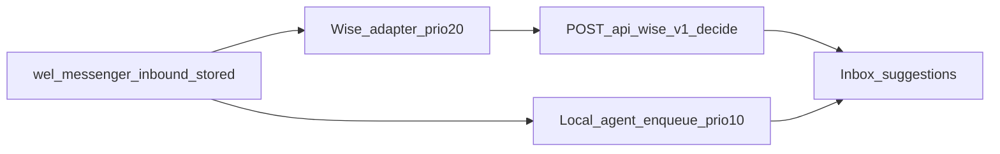
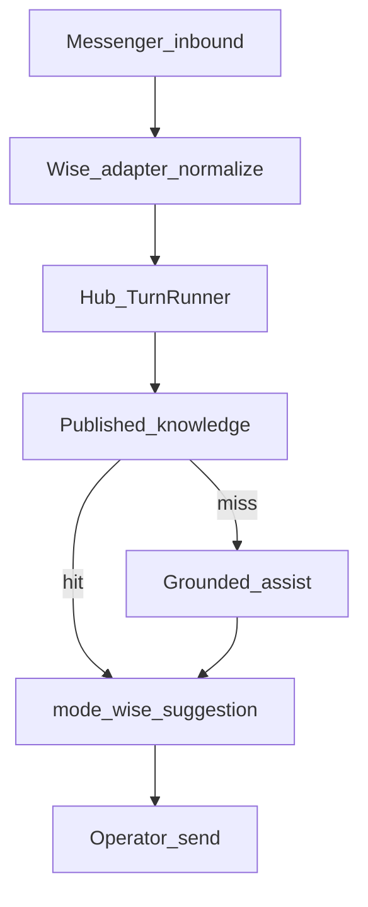

# Messenger → Wise-only Brain

## Goal (from conversation)

- **Messenger has no local brain** — no local intent/FAQ/RAG/Full auto as the reply source.
- **All intelligence** lives on hub Wise AI (brain **0.7.0**: knowledge hit + grounded assist + Learning drafts).
- Plugin = **pipe + inbox UI + commerce** + thin adapter.
- **Default send policy:** Assist only (operator sends). Auto-send stays off unless a later explicit unlock (out of this slice).

## Locked defaults

| Decision | Choice |
|----------|--------|
| Customer send | Assist only (human sends from inbox) |
| Local agent | Code gate when Wise enabled + panel/settings Wise-primary |
| Hub work | None required this slice (already shipped) |

## Current state

- Wise path already exists: `helpers/wise-ai.php` (`wel_wise_ai_on_inbound` → `decide` → `messenger_agent_turns.mode=wise`, `auto_send=false`).
- Local path still runs when `ai_enabled` + `automation_mode` ≠ `off`: `wel_messenger_agent_enqueue` priority 10.
- Decide context today is thin: `platform`, `offer_kind`, `region`, `product_id`/`product_name` — missing `thread` / `funnel` / `candidates` / `signals` / order facts that hub grounded assist expects.

## Target architecture

**Non-goals this slice:** Wise Full auto-send; deleting local knowledge tables; hub code changes.

## Implementation plan

### 1) Hard gate — local reply brain off when Wise is on

In `wel_messenger_agent_enqueue` (and reply reprocess entry points):

- If `wel_wise_ai_get_settings()['enabled']` → **return early** (no AI reply job enqueue).
- Keep lightweight ops that are not a brain: lead-label update on inbound may stay (CRM tags only).
- Document: with Wise enabled, Sales Agent `automation_mode` is ignored for replies.

Safety: when enabling Wise in adapter save, force messenger `automation_mode=off` (or banner “Local AI reply disabled”).

### 2) Enrich Wise decide context from Messenger state

Extend `wel_wise_ai_decide_for_message` context builder:

| From thread_state / contact | Into `context` |
|-----------------------------|----------------|
| lead product id/name | `product_id`, `product_name`, `offer_kind` |
| stage / goal hints | `funnel.stage`, `funnel.goal`, `funnel.product_confirmed` |
| memory summary if present | `thread.summary`, `open_issues`, `pending_question` |
| lead label / tags | `customer.tags`, `customer.external_id` (psid) |
| candidate_product_ids | `candidates[]` (id + title snapshots) |
| wc_order_id on contact | `order_id` / thin `order.status` if cheap |
| settings region | `region`, `locale` |

Never dump full message history; hub memory uses `conversation_id` (`wel:channel:page:psid`).

### 3) Inbox = Wise-primary UX

- Prefer `mode=wise` suggestions when Wise enabled.
- Small badges: `decision.source`, `grounded_assist.score`, `gap`.
- Keep feedback → hub (`wel_wise_ai_feedback_from_agent_turn`).

### 4) Operator setup (panel + flywheel)

1. Hub URL + Wise API key + Assist mode  
2. Hub LLM on (grounded assist)  
3. Publish catalog/FAQ on hub  
4. Local automation off (auto when Wise on)  
5. Test inbound → wise suggestion → human send  

Update `ADAPTER.md` WEL section: **Wise-only reply policy**.

### 5) Tests (plugin)

- Wise enabled → no `messenger_jobs` AI enqueue.  
- Context builder emits `thread` / `funnel` / `candidates` from fixture `thread_state`.  
- Wise turn insert + feedback still work (mock hub HTTP).

## File touch list (plugin)

- `helpers/messenger-agent.php` — enqueue gate  
- `helpers/wise-ai.php` — rich context builder  
- `WiseAiAdapterPanel.vue` — Wise-only messaging / save side-effect  
- Messenger inbox Vue — minimal Wise badges  
- `ADAPTER.md` + journal note  
- `tests/` — gate + context shape  

## Rollout

1. Ship gate + rich context + panel copy  
2. Merchant: enable Wise, confirm local jobs stop, one live Assist reply  
3. Publish knowledge until `source=knowledge` rises  

## Explicitly deferred

- Wise auto-send to Graph  
- Removing local product_knowledge / embeddings tables  
- One-click migrate all local FAQs into hub  
